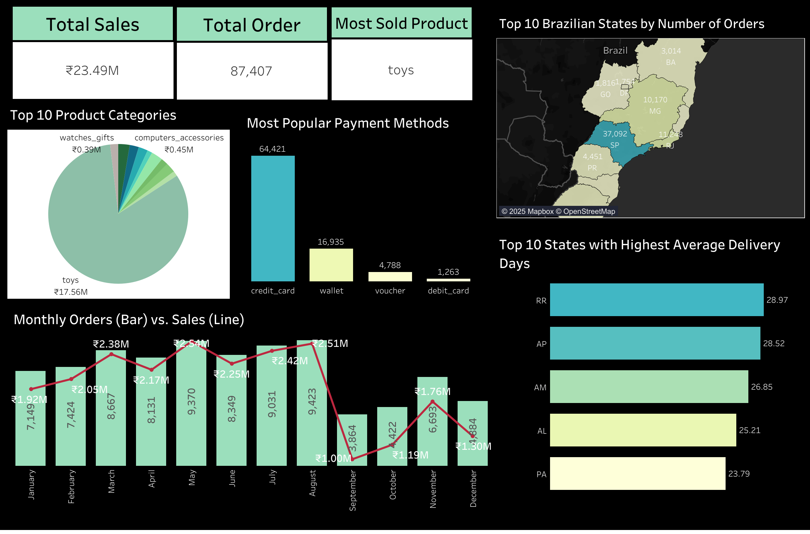

# 🛍️ Sales and Product Performance Analysis

This project explores **sales and product performance** in an e-commerce business using real multi-table data.  
The goal is to gain insights into **regional sales trends, payment preferences, seasonal patterns, and product performance**.

---

## 📂 Project Structure

```
Sales and Product Performance Analysis
├── dashboard/
│   └── Sales_Performance_Analysis.twbx
├── notebooks/
│   ├── exploratory_data_analysis.ipynb
│   └── sales_and_product_performance_analysis.ipynb
├── scripts/
│   ├── ingestion_db.py
│   └── get_order_summary.py
├── output/
│   └── Sales and Product Performance Report.pdf
├── .gitignore
└── README.md
```

---

## 🚀 Workflow Overview

### 1️⃣ Data Collection & Database Setup

- **Five raw CSVs** from the Kaggle “Ecommerce Order & Supply Chain Dataset” were used  
  (`orders`, `order_items`, `products`, `customers`, `payments`).
- Imported these files into a **SQL database** for easier relational queries.

### 2️⃣ Exploratory Data Analysis (EDA)

- Queried the database in Python using **pandas + SQLAlchemy**.
- Performed **data cleaning**:
  - Removed null / duplicate rows,
  - Converted date columns to datetime,
  - Ensured numeric columns had correct data types.

### 3️⃣ Building a Unified Dataset

- **Joined multiple tables** (orders, order items, customers, payments, products) to create a single **analysis-ready dataframe**.
- Selected only the columns necessary for sales performance analytics.
- Saved this **curated dataframe back to the database** for future use.

### 4️⃣ Sales & Product Performance Analysis

Key analyses and visualisations included:

- **Top product categories** by total sales.
- **Sales trends by year and by month**, identifying seasonal patterns.
- **Average delivery days** by state.
- **Most popular payment methods**.
- **Regions (Brazilian states)** generating the highest number of orders.
- **Most sold product in each state**.

### 5️⃣ Visualisation

- Plotted insights using:
  - **Matplotlib & Seaborn** for Python charts,
  - **Tableau** dashboards to create interactive KPIs and maps.

---

## 📊 Key Insights

- **São Paulo (SP)** drives the highest order volume (~37k orders), followed by **Rio de Janeiro (RJ)** and **Minas Gerais (MG)**.
- **Credit card** is the dominant payment method.
- **Sales is low in last quarter**, indicating strong year-end seasonality.
- Some states exhibit **longer average delivery times**, highlighting potential supply chain optimization opportunities.

---

## 🛠️ Tech Stack

- **Python**: pandas, matplotlib, seaborn, SQLAlchemy
- **Database**: SQLite (or your chosen SQL engine)
- **Visualisation**: Tableau

---

## 💡 How to Reproduce

1. Clone this repository.
2. Download the Kaggle dataset: [Ecommerce Order & Supply Chain Dataset](https://www.kaggle.com/datasets/bytadit/ecommerce-order-dataset) (place CSVs in the `data/` folder).
3. Run the Jupyter notebook `Sales and Product Performance Analysis.ipynb` step by step.
4. (Optional) Open the Tableau workbook to explore interactive dashboards.

---

## 🔗 Dataset

[Ecommerce Order & Supply Chain Dataset – Kaggle](https://www.kaggle.com/)

_(Replace the above link with the exact dataset URL you used.)_

---

## 📌 Future Enhancements

- Automate daily ETL pipeline to update the dashboard.
- Add predictive modelling for **sales forecasting** or **delivery time estimation**.
- Deploy Tableau dashboards for real-time monitoring.

---

**Author:** Zainab Shaikh

---

> ⚠️ **Note:** All customer and order IDs are anonymised. This project is for **educational and portfolio purposes only**.

---

### ✅ Next Steps

- Save this text in a file called **`README.md`** in your GitHub repository.
- You can add images (plots or Tableau screenshots) by storing them in a folder like `images/` and linking them in the README using markdown syntax:
  ```
  
  ```
